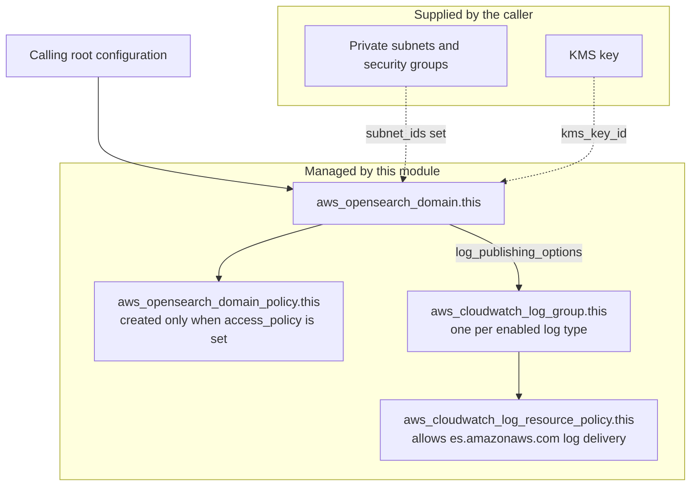

# core-cloud-opensearch-tf-module

Core Cloud child Terraform module for provisioning Amazon OpenSearch Service domains using current Home Office repository standards.

The module creates a single OpenSearch domain and its supporting logging resources:

- strongly typed variables with input validation
- encryption at rest, node-to-node encryption, and HTTPS-only endpoints by default
- gp3-backed storage with configurable IOPS and throughput
- optional CloudWatch log delivery, including the log delivery resource policy
- optional VPC deployment using subnets and security groups owned by the caller
- optional fine-grained access control and domain access policy

## Requirements

| Name | Version |
|------|---------|
| terraform | >= 1.5.0 |
| aws | ~> 5.40 |

## Providers

| Name | Version |
|------|---------|
| aws | ~> 5.40 |

## Modules

No external Terraform modules are used.

## Resources

| Name | Type |
|------|------|
| aws_cloudwatch_log_group.this | resource |
| aws_cloudwatch_log_resource_policy.this | resource |
| aws_opensearch_domain.this | resource |
| aws_opensearch_domain_policy.this | resource |
| aws_iam_policy_document.cloudwatch_log_delivery | data source |

## Usage

```hcl
module "opensearch" {
  source = "github.com/Home-Office-Digital/core-cloud-opensearch-tf-module"

  name           = "example-domain"
  engine_version = "OpenSearch_2.17"
  instance_type  = "m6g.large.search"
  instance_count = 2

  subnet_ids         = ["subnet-abc123", "subnet-def456"]
  security_group_ids = ["sg-12345678"]

  log_publishing_options = {
    ES_APPLICATION_LOGS = {
      enabled           = true
      retention_in_days = 30
    }
  }

  cc_tags = {
    cost_centre      = "cc-001"
    account_code     = "ac-001"
    portfolio_id     = "pf-001"
    project_id       = "pr-001"
    service_id       = "sv-001"
    environment_type = "dev"
    owner_business   = "platform"
    budget_holder    = "engineering"
  }
}
```

## VPC Deployment

To deploy a private OpenSearch domain, the calling configuration must provide existing private `subnet_ids` and appropriate `security_group_ids`. This module creates the OpenSearch domain only; it does not create a VPC, subnets, route tables, or security groups.

A VPC-based OpenSearch endpoint is not publicly reachable. Users need an approved network path into the VPC, such as VPN, Direct Connect, or an internal proxy or bastion access pattern, to reach OpenSearch Dashboards. IP-restricted browser access to Dashboards applies only to public-endpoint deployments.

## Architecture



The module supports two endpoint modes, selected by whether `subnet_ids` is supplied:

| Mode | Condition | Dashboards access |
|---|---|---|
| Public endpoint | `subnet_ids` is empty | AWS-managed public endpoint, restricted with an `access_policy` that conditions on `aws:SourceIp` |
| VPC endpoint | `subnet_ids` and `security_group_ids` supplied | Reachable only over an approved network path into the VPC |

## Design Notes

- VPC deployment is explicit. The module does not create permissive security groups on your behalf.
- Access policies are opt-in. Pass `access_policy` when the calling stack needs domain policy management.
- Fine-grained access control is supported using caller-owned IAM identities. The module does not create IAM users.
- The interface is intentionally additive so new optional capabilities can be introduced without breaking existing callers.

## Inputs

| Name | Description | Type | Default | Required |
|------|-------------|------|---------|:--------:|
| access_policy | Optional JSON access policy for the domain. Leave empty to skip policy creation. | string | `""` | no |
| advanced_security_options_enabled | Whether to enable advanced security options | bool | `false` | no |
| anonymous_auth_enabled | Whether to allow anonymous auth while fine-grained access control is enabled | bool | `false` | no |
| automated_snapshot_start_hour | UTC hour for automated snapshots | number | `0` | no |
| cc_tags | Core Cloud mandatory tagging values | object | n/a | yes |
| cloudwatch_log_resource_policy_name | Optional explicit name for the CloudWatch Logs resource policy | string | `null` | no |
| custom_endpoint | Optional custom endpoint hostname | string | `null` | no |
| custom_endpoint_certificate_arn | ACM certificate ARN used when custom_endpoint is configured | string | `null` | no |
| dedicated_master_count | Number of dedicated master nodes when dedicated masters are enabled | number | `3` | no |
| dedicated_master_enabled | Whether to use dedicated master nodes | bool | `false` | no |
| dedicated_master_type | Instance type for dedicated master nodes | string | `"m6g.large.search"` | no |
| ebs_enabled | Whether to attach EBS storage to data nodes | bool | `true` | no |
| ebs_iops | Provisioned IOPS used for gp3 and io1 volumes | number | `3000` | no |
| ebs_throughput | Provisioned throughput in MiB/s for gp3 volumes | number | `125` | no |
| ebs_volume_size | EBS volume size in GiB | number | `20` | no |
| ebs_volume_type | EBS volume type for data nodes | string | `"gp3"` | no |
| encrypt_at_rest_enabled | Whether to enable encryption at rest | bool | `true` | no |
| engine_version | OpenSearch or legacy Elasticsearch engine version, for example OpenSearch_2.17 | string | `"OpenSearch_2.17"` | no |
| enforce_https | Whether to require HTTPS for the domain endpoint | bool | `true` | no |
| instance_count | Number of data nodes in the domain | number | `2` | no |
| instance_type | Instance type for data nodes | string | `"m6g.large.search"` | no |
| internal_user_database_enabled | Whether to enable the internal user database for fine-grained access control | bool | `false` | no |
| kms_key_id | Optional KMS key ID or ARN for encryption at rest | string | `null` | no |
| log_group_retention_in_days | Default retention period applied to module-managed log groups | number | `30` | no |
| log_publishing_options | Log publishing configuration keyed by OpenSearch log type | map(object) | see variables.tf | no |
| manage_cloudwatch_log_resource_policy | Whether the module should manage the CloudWatch Logs resource policy used for OpenSearch log delivery | bool | `true` | no |
| master_user_arn | Optional IAM ARN for the domain master user | string | `null` | no |
| master_user_name | Optional master user name when using the internal user database | string | `null` | no |
| master_user_password | Optional master user password when using the internal user database | string | `null` | no |
| multi_az_with_standby_enabled | Whether to enable multi-AZ with standby | bool | `false` | no |
| name | Name of the OpenSearch domain | string | n/a | yes |
| node_to_node_encryption_enabled | Whether to enable node-to-node encryption | bool | `true` | no |
| security_group_ids | Security group IDs for VPC deployment | list(string) | `[]` | no |
| subnet_ids | Subnet IDs for VPC deployment | list(string) | `[]` | no |
| tags | Additional tags merged on top of the mandatory Core Cloud tags | map(string) | `{}` | no |
| tls_security_policy | TLS security policy for the domain endpoint | string | `"Policy-Min-TLS-1-2-2019-07"` | no |
| warm_count | Number of UltraWarm nodes when warm_enabled is true | number | `2` | no |
| warm_enabled | Whether UltraWarm nodes are enabled | bool | `false` | no |
| warm_type | Instance type for UltraWarm nodes | string | `"ultrawarm1.medium.search"` | no |
| zone_awareness_count | Availability zone count used when zone awareness is enabled | number | `2` | no |
| zone_awareness_enabled | Whether zone awareness is enabled | bool | `false` | no |

## Outputs

| Name | Description |
|------|-------------|
| dashboard_endpoint | OpenSearch Dashboards endpoint |
| domain_arn | ARN of the OpenSearch domain |
| domain_endpoint | Endpoint used for index, search, and ingest traffic |
| domain_id | Unique identifier for the OpenSearch domain |
| log_group_names | Names of CloudWatch log groups managed by the module |

