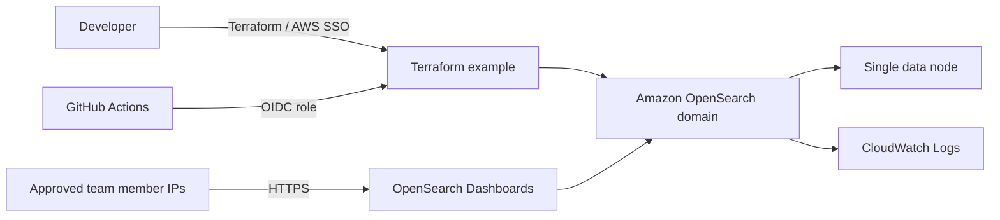

# OpenSearch Proof of Concept

## Team Demo

Amazon OpenSearch Service deployment for the CCRubrikPOCTest account.

---

## Goal

Demonstrate that we can provision and operate an Amazon OpenSearch domain using the Core Cloud Terraform module.

- Repeatable infrastructure through Terraform
- Secure OpenSearch Dashboards access for approved users
- Low-cost, single-node configuration for validation
- Clear path to a production-ready deployment

---

## What We Deployed

| Component | Configuration |
|---|---|
| OpenSearch domain | `cc-rubrik-poc-test` |
| Engine | OpenSearch 2.17 |
| Data nodes | 1 |
| Instance type | `t3.small.search` |
| Storage | 20 GiB gp3 EBS |
| Region | `eu-west-2` |
| Logs | OpenSearch application logs in CloudWatch Logs |

---

## Architecture



---

## What Is a Data Node?

The data node is the managed OpenSearch server that performs the work:

- Stores indexes and documents on EBS storage
- Processes indexing requests
- Executes searches and aggregations
- Serves results to OpenSearch Dashboards

This PoC has one data node, so it is not highly available. A production deployment would use multiple nodes across Availability Zones and may use dedicated master nodes.

---

## Security Controls

- Encryption at rest is enabled.
- Node-to-node encryption is enabled.
- HTTPS is enforced for the domain endpoint.
- Dashboard access is denied by default.
- Temporary browser access is limited to explicitly approved public CIDR ranges.
- GitHub Actions uses AWS OIDC rather than long-lived AWS credentials.

---

## How Dashboard Access Works

The Terraform example creates an OpenSearch access policy that:

1. Permits authenticated AWS account access.
2. Optionally permits browser requests from approved IP CIDRs.

For a temporary demo, an operator supplies their public IP as a `/32` CIDR:

```sh
terraform -chdir=examples/cc-rubrik-poc-test apply \
  -var='aws_profile=CCRubrikPOCTest' \
  -var='dashboard_allowed_cidrs=["YOUR.PUBLIC.IP/32"]'
```

Remove the CIDR after the demo to revoke browser access.

---

## Live Demo Flow

1. Open the OpenSearch Dashboards URL from Terraform output.
2. Show the domain health and node overview.
3. Create a sample index, for example `team-demo`.
4. Add a few documents.
5. Search the documents and show an aggregation or visualization.
6. Open CloudWatch Logs to show OpenSearch application logging.
7. Return to the Terraform configuration to show the deployment is declared in code.

---

## Suggested Sample Data

In OpenSearch Dashboards Dev Tools, run:

```http
PUT team-demo

POST team-demo/_doc/1
{
  "service": "Rubrik PoC",
  "environment": "test",
  "status": "healthy",
  "event_time": "2026-08-14T10:00:00Z"
}

POST team-demo/_doc/2
{
  "service": "OpenSearch PoC",
  "environment": "test",
  "status": "healthy",
  "event_time": "2026-08-14T10:05:00Z"
}

GET team-demo/_search
{
  "query": {
    "match_all": {}
  }
}
```

---

## Deployment Options

| Method | Use case |
|---|---|
| Local Terraform with AWS SSO | Development, investigation, and PoC operations |
| GitHub Actions plan | Review proposed infrastructure changes |
| GitHub Actions apply | Controlled deployment from the configured branch |
| GitHub Actions destroy | Remove the PoC when it is no longer needed |

The deployment runbooks are in [README.md](README.md) and [workflow README](../../.github/workflows/README.md).

---

## PoC Limits

- One data node means no high availability or fault tolerance.
- The `t3.small.search` instance is intended for low-cost testing, not production load.
- Browser access is IP-based and should be temporary.
- Access policy is account-level for the PoC; production should use least-privilege IAM roles and a VPC design.

---

## Production Direction

- Deploy into a VPC with private subnets and security groups.
- Use multiple data nodes across Availability Zones.
- Evaluate dedicated master nodes and Multi-AZ with standby.
- Define retention, snapshots, alarms, and operational dashboards.
- Replace temporary CIDR access with organization-approved authentication and network access patterns.
- Apply via protected GitHub Actions workflows with reviewed plans.

---

## Outcome

The PoC proves that the module can provision a secure, observable OpenSearch domain and provide controlled Dashboards access through Terraform.

Questions and discussion.